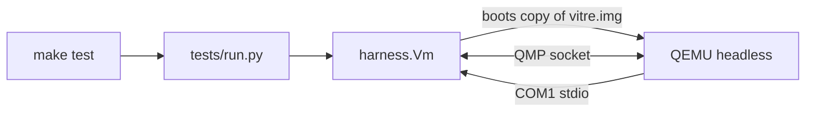

# Architecture

## Disk image

- LBA 0: stage 1 (MBR)

## Test flow

```mermaid
flowchart LR
  make[make test] --> run[tests/run.py]
  run --> vm[harness.Vm]
  vm -->|boots copy of vitre.img| qemu[QEMU headless]
  qemu -->|COM1 stdio| vm
  vm <-->|QMP socket| qemu
```
